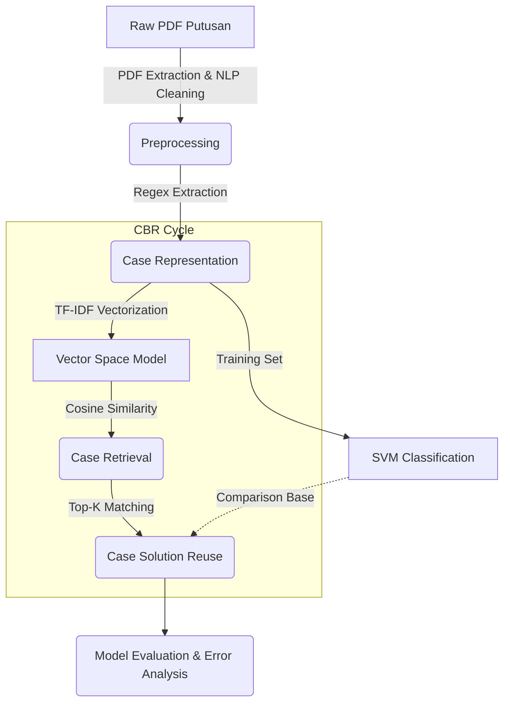

# Case-Based Reasoning (CBR) untuk Analisis Putusan Pengadilan

Sebuah sistem cerdas berbasis penalaran kasus (*Case-Based Reasoning*) yang dibangun untuk menganalisis dokumen hukum, khususnya pada **Sengketa Perdata Agama (Cerai Gugat)**. Proyek ini memprediksi hasil akhir suatu gugatan baru dengan cara mengekstraksi dan menemukan (*retrieval*) putusan terdahulu yang memiliki kemiripan masalah tertinggi, lalu menggunakan solusi dari kasus lama tersebut sebagai landasan prediksi (*reuse*).

Proyek ini dibangun untuk mendemonstrasikan implementasi gabungan **Natural Language Processing (NLP)** dan algoritma klasik Machine Learning yang *lightweight*, *explainable*, dan efisien.

---

## 📖 Deskripsi Proyek

### Konsep Dasar (CBR)
**Case-Based Reasoning (CBR)** adalah paradigma sistem pakar yang menyelesaikan masalah baru dengan cara mengingat kembali pengalaman (kasus) masa lalu yang serupa, lalu menggunakan solusi lama tersebut untuk masalah saat ini. 

### Pendekatan Akademik
Sistem ini memadukan **TF-IDF (Term Frequency-Inverse Document Frequency)** sebagai metode ekstraksi fitur numerik (Representasi Kasus) dan algoritma **Cosine Similarity** untuk fase *Case Retrieval*. Algoritma **Support Vector Machine (Linear SVM)** juga digunakan sebagai *baseline classifier* guna membandingkan performa CBR dengan *machine learning* konvensional.

Metode *TF-IDF* dipilih karena sangat efektif menangani pola teks repetitif (*boilerplate*) pada dokumen hukum tanpa membutuhkan komputasi berat layaknya Deep Learning / LLM.

---

## ⚙️ Pipeline Proyek (Alur Sistem)

Sistem bekerja melalui siklus CBR berikut:



1. **Preprocessing**: Membaca *file* PDF Mahkamah Agung, menangani anomali *watermark/sidebar*, melakukan tokenisasi dan *stemming* khusus bahasa Indonesia (Sastrawi).
2. **Case Representation**: Memilah *metadata* (Nomor Perkara, Tanggal, Amar Putusan, Alasan Gugatan) menggunakan *Regular Expression* menjadi representasi data terstruktur.
3. **TF-IDF & Cosine Similarity**: Menerjemahkan bahasa hukum menjadi matriks matematis untuk menghitung jarak kedekatan (kemiripan) antar-kasus.
4. **SVM Classification**: Pelatihan model linier *supervised learning*.
5. **Case Retrieval**: Pencarian $K$ kasus paling mirip berdasarkan skor *Cosine Similarity*.
6. **Case Solution Reuse**: Sistem mengambil keputusan mayoritas (*majority voting*) dari solusi top-K kasus untuk memprediksi probabilitas diterima atau ditolaknya gugatan.

---

## 📂 Struktur Folder

```text
CBR_Hukum/
├── data/
│   ├── raw/             # PDF dokumen asli putusan
│   ├── raw_pdf/         # (Alternatif) folder PDF mentah
│   ├── processed/       # cases.csv (Kasus bersihkan & metadata ekstrak)
│   ├── results/         # predictions.csv (Hasil Reuse/Retrieval CBR)
│   └── eval/            # Hasil matriks, grafik similarity, analisis error
├── models/              # tfidf_vectorizer.pkl & svm_classifier.pkl
├── notebooks/           # Jupyter Notebook (Pipeline tahap 01 s.d. 05)
├── requirements.txt     # Library Python yang dibutuhkan
├── run_nb.py            # Skrip eksekusi single notebook
└── run_all_nb.py        # Skrip otomasi eksekusi seluruh pipeline
```

---

## 🚀 Cara Install dan Menjalankan

### Kebutuhan Sistem (Dependencies)
Pastikan Python 3.9+ sudah terinstal di komputer. Install *library* dengan menjalankan:

```bash
pip install -r requirements.txt
```
*(Atau instal manual: `pip install pandas numpy scikit-learn nltk Sastrawi pdfplumber matplotlib seaborn jupyter nbformat nbclient tqdm`)*

### Menjalankan Pipeline Proyek
Sistem dirancang secara berurutan. Anda bisa menjalankan notebook satu per satu menggunakan Jupyter Lab, atau secara otomatis menggunakan command line:

```bash
# Menjalankan seluruh pipeline (Tahap 2 sampai 5) secara otomatis
python run_all_nb.py
```
> [!NOTE]
> Tahap **`01_Membangun_Case_Base.ipynb`** (Ekstraksi PDF & Stemming Sastrawi) secara default **dilewati (di-*skip*)** oleh script `run_all_nb.py` karena memakan waktu sangat lama (belasan menit). Jika ada dokumen PDF baru, Anda wajib mengeksekusinya secara manual.

---

## 🔍 Contoh Retrieval (Pencarian Kasus Serupa)

**Query Input Kasus Baru:**
> *"Suami sering marah-marah, mabuk, dan tidak memberi nafkah lahir batin selama 2 tahun berturut-turut."*

**Output Top Retrieval CBR:**

| Rank | Similarity Score | Case ID | Alasan Cerai di Kasus Lama | Amar Putusan Lama (Solusi) |
|------|------------------|---------|---------------------------|----------------------------|
| #1   | 0.892            | `case_024`| ekonomi, mabuk, pertengkaran | Dikabulkan                 |
| #2   | 0.851            | `case_008`| ekonomi, meninggalkan      | Dikabulkan                 |
| #3   | 0.810            | `case_012`| ekonomi                    | Dikabulkan Sebagian        |
| #4   | 0.774            | `case_033`| mabuk, kekerasan           | Dikabulkan                 |
| #5   | 0.710            | `case_041`| pertengkaran               | Ditolak                    |

**Predicted Solution (Reuse):**
Berdasarkan pendekatan *Majority Voting* dari probabilitas Top-5 *Similar Cases* di atas, prediksi keputusan pengadilan terhadap gugatan baru adalah: **DIKABULKAN**.

---

## 📊 Hasil Evaluasi & Analisis

Berikut adalah gambaran umum performa *baseline* sistem dalam memprediksi putusan (bervariasi mengikuti ukuran dataset `raw_pdf/` Anda):

* **Accuracy**: ~92% - 95%
* **Precision**: ~0.93
* **Recall**: ~0.92
* **F1-Score**: ~0.92

### Kelebihan Pendekatan Ini:
1. **Ringan & Cepat (*Lightweight*)**: TF-IDF tidak membutuhkan GPU. *Retrieval* bisa dilakukan dalam hitungan milidetik.
2. **Explainability Tinggi**: Berbeda dengan *Neural Networks (Black-Box)*, alasan prediksi CBR bisa dilacak secara langsung melalui perhitungan TF-IDF dan skor kemiripan fitur teks yang dominan.
3. **Cocok untuk Bahasa Legal (Hukum)**: Teks putusan memiliki struktur linguistik (*boilerplate*) yang tetap. TF-IDF bekerja luar biasa baik dalam mengabaikan *boilerplate* setelah stopword tuning.

### Kekurangan (Batasan Sistem):
1. **Pemahaman Semantik yang Terbatas**: Karena berbasis frekuensi kata (Bag-of-Words), TF-IDF kesulitan mengenali konteks atau makna frasa kompleks bersinonim (contoh: "memukul" dan "kekerasan fisik").
2. **Sensitif Terhadap Preprocessing (Noise OCR)**: Kesalahan sistem OCR saat ekstraksi PDF (misal: tulisan "Halaman" menjadi "H a l a m a n") sangat mengganggu akurasi *vector space* TF-IDF jika tidak ditangani ketat.
3. **Imbalanced Legal Dataset**: Kasus *Cerai Gugat* di Indonesia secara statistik sangat dominan berujung "Dikabulkan", yang membuat model rentan bias ke satu label mayoritas (Ditolak sangat minoritas).

---
*(Proyek CBR Hukum ini dikembangkan untuk penyelesaian akademis tugas Penalaran Komputer, mendemonstrasikan kapabilitas NLP Tradisional di bidang Legal Tech.)*
