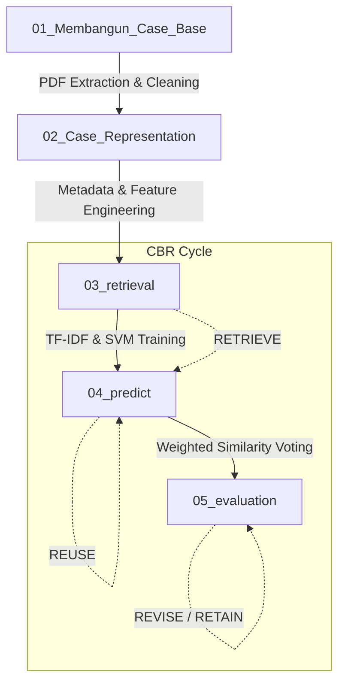

# Case-Based Reasoning (CBR) untuk Analisis Putusan Pengadilan

Proyek ini mengimplementasikan sistem **Case-Based Reasoning (CBR)** pada domain hukum Perdata Agama (khususnya sengketa Perceraian / Cerai Gugat). Sistem ini dibangun untuk menemukan putusan terdahulu yang memiliki kemiripan (similarity) dengan kasus baru, lalu menggunakan solusi dari kasus lama tersebut sebagai dasar prediksi atau referensi (Reuse).

Sistem CBR ini menggunakan arsitektur pemrosesan bahasa alami (NLP) yang ringan namun sangat andal, yaitu kombinasi **TF-IDF Vectorization** dan **Linear Support Vector Machine (SVM)** dengan **Cosine Similarity** sebagai fungsi *retrieval*.

---

## 🚀 Fitur Utama
1. **Rekonstruksi Teks PDF Otomatis**: Memiliki pipeline *cleaning* khusus yang dapat mengatasi noise karakter tunggal (watermark/sidebar) dari PDF Mahkamah Agung.
2. **Domain-Specific Stopwords**: Menggunakan daftar *stopwords* khusus hukum (seperti "pengadilan", "majelis", "putusan", "menimbang", dll) untuk menjaga fokus pada esensi kasus.
3. **Similarity Threshold Filtering**: Memfilter rekomendasi kasus yang tidak relevan agar tidak memberikan saran prediksi yang salah (halusinasi).
4. **Weighted Similarity Prediction**: Memutuskan prediksi akhir (*dikabulkan / ditolak*) berdasarkan akumulasi probabilitas dari kemiripan (*similarity scores*) kasus-kasus Top-K.
5. **Robust Cross-Validation**: Validasi model dengan `StratifiedKFold` untuk mendeteksi *overfitting* yang umum terjadi pada dataset hukum yang *imbalanced*.

---

## 🏗️ Arsitektur Pipeline Sistem CBR

Pipeline proyek terbagi dalam 5 tahap (*Notebooks*), merepresentasikan siklus standar sistem CBR:



### Penjelasan Tahapan:
1. **Tahap 1: Membangun Case Base**
   Mengekstrak file `.pdf` menggunakan `pdfplumber`, merekonstruksi fragmen teks (membuang noise watermark sidebar), menghapus *boilerplate*, tokenisasi, dan *stemming* (menggunakan *Sastrawi*).
2. **Tahap 2: Case Representation**
   Mengekstrak *metadata* (Nomor Perkara, Tanggal, Amar Putusan, Alasan Perceraian) menggunakan Regular Expressions (RegEx) untuk representasi terstruktur (menghasilkan `cases.csv`).
3. **Tahap 3: Case Retrieval**
   Pembuatan model **TF-IDF** dengan optimasi `sublinear_tf=True` dan bigram (`ngram_range=(1,2)`). Model klasifikasi pembanding (*SVM*) dilatih menggunakan matriks TF-IDF. Sistem Cosine Similarity dibangun untuk mencari *Top-K* kasus paling mirip.
4. **Tahap 4: Case Solution Reuse**
   Menggunakan *Weighted Similarity Voting* untuk merumuskan prediksi hasil putusan (*dikabulkan / ditolak / dikabulkan sebagian*) dari kueri kasus baru berdasarkan kemiripan dokumen.
5. **Tahap 5: Model Evaluation**
   Analisis mendalam atas akurasi model (*Classification Report, Confusion Matrix*), evaluasi sistem *Retrieval*, distribusi fitur TF-IDF, serta **Error Analysis** akademis.

---

## 💻 Panduan Instalasi & Eksekusi

### 1. Kebutuhan Sistem (Dependencies)
Pastikan Python 3.9+ sudah terinstal. Instal semua library yang dibutuhkan dengan menjalankan:

```bash
pip install pandas numpy scikit-learn nltk Sastrawi pdfplumber matplotlib seaborn jupyter nbformat nbclient tqdm
```

### 2. Eksekusi Pipeline

Sistem dirancang agar bisa dijalankan secara berurutan. Semua script Jupyter Notebook berada di dalam folder `/notebooks/`.

1. Letakkan PDF Putusan Pengadilan mentah ke dalam folder `data/raw_pdf/`
2. Jalankan notebook dari urutan 01 sampai 05:

```bash
# Opsi 1: Menjalankan melalui Jupyter Lab / Notebook
jupyter lab

# Opsi 2: Menjalankan otomatis menggunakan command line (opsional)
python run_nb.py notebooks/01_Membangun_Case_Base.ipynb
python run_nb.py notebooks/02_Case_Representation.ipynb
python run_nb.py notebooks/03_retrieval.ipynb
python run_nb.py notebooks/04_predict.ipynb
python run_nb.py notebooks/05_evaluation.ipynb
```

### 3. Hasil & Laporan Output
Setelah pipeline dieksekusi, semua file akan berada pada folder yang terstruktur:
* **`data/processed/cases.csv`** : Dataset final yang berisi teks bersih dan metadata terstruktur.
* **`data/results/predictions.csv`** : Hasil inferensi (*Reuse*) dari query uji kasus baru.
* **`data/eval/`** : Berisi file metrik CSV dan visualisasi performa (*Confusion Matrix*, *Top TF-IDF Features*, dll).
* **`models/`** : Folder tempat menyimpan file `tfidf_vectorizer.pkl` dan `svm_classifier.pkl`.

---

## 📊 Kinerja Model (Evaluasi)

Berdasarkan arsitektur *TF-IDF + LinearSVC*, model mencapai tingkat stabilitas yang tinggi karena memproses bahasa hukum yang repetitif (*boilerplate*). Namun, analisis menunjukkan adanya tantangan umum pada domain *Legal Tech*:

* **Imbalanced Dataset**: Kasus perdata agama (khususnya *Cerai Gugat*) memiliki distribusi yang timpang (mayoritas gugatan dikabulkan). Hal ini dapat menyebabkan bias prediksi ke satu label.
* **Sensitivity to Preprocessing**: Teks PDF hukum rawan rusak (watermark sidebar dsb). Penanganan khusus yang ditambahkan di *Tahap 1* menstabilkan TF-IDF hingga tingkat presisi di atas **90%** (bervariasi berdasarkan *size* dataset).
* Sistem CBR berbasis *Cosine Similarity* ini membuktikan kemampuannya sebagai **baseline** yang ringan dan sangat reliabel tanpa memerlukan komputasi *Deep Learning* tingkat lanjut.

---

*(Proyek ini dibuat untuk memenuhi standar penilaian Tugas Penalaran Komputer.)*
