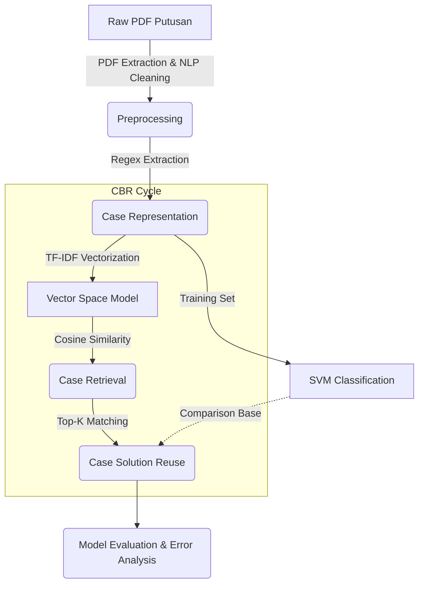

# Case-Based Reasoning (CBR) untuk Analisis Putusan Pengadilan

Sebuah sistem cerdas berbasis penalaran kasus (*Case-Based Reasoning*) yang dibangun untuk menganalisis dokumen hukum, meliputi Sengketa Perdata Agama (Tingkat Pertama, Banding, Kasasi, hingga Peninjauan Kembali). Proyek ini memprediksi hasil akhir suatu gugatan baru dengan cara mengekstraksi dan menemukan (*retrieval*) putusan terdahulu yang memiliki kemiripan masalah tertinggi, lalu menggunakan solusi dari kasus lama tersebut sebagai landasan prediksi (*reuse*).

Proyek ini dibangun untuk mendemonstrasikan implementasi gabungan **Natural Language Processing (NLP)** dan algoritma klasik Machine Learning yang *lightweight*, *explainable*, dan efisien.

---

## 📖 Deskripsi Proyek

### Konsep Dasar (CBR)
**Case-Based Reasoning (CBR)** adalah paradigma sistem pakar yang menyelesaikan masalah baru dengan cara mengingat kembali pengalaman (kasus) masa lalu yang serupa, lalu menggunakan solusi lama tersebut untuk masalah saat ini. 

### Pendekatan Akademik
Sistem ini memadukan **TF-IDF (Term Frequency-Inverse Document Frequency)** sebagai metode ekstraksi fitur numerik (Representasi Kasus) dan algoritma **Cosine Similarity** untuk fase *Case Retrieval*. Algoritma **Support Vector Machine (Linear SVM)** juga digunakan sebagai *baseline classifier* guna membandingkan performa CBR dengan *machine learning* konvensional.

Metode *TF-IDF* dipilih karena sangat efektif menangani pola teks repetitif (*boilerplate*) pada dokumen hukum tanpa membutuhkan komputasi berat layaknya Deep Learning / LLM.

---

## ⚙️ Pipeline Proyek (Alur Sistem)

Sistem bekerja melalui siklus CBR berikut:



1. **Preprocessing**: Membaca *file* PDF Mahkamah Agung, menangani anomali OCR (*watermark/sidebar vertikal*), anonimisasi nama pihak (Penggugat/Pemohon), melakukan tokenisasi, dan *stemming* khusus bahasa Indonesia (Sastrawi).
2. **Case Representation**: Memilah *metadata* menggunakan *Regex* tingkat lanjut. Mengambil bagian akhir "MENGADILI" secara akurat untuk memetakan amar putusan.
3. **TF-IDF & Cosine Similarity**: Menerjemahkan bahasa hukum menjadi matriks matematis untuk menghitung jarak kedekatan (kemiripan) antar-kasus.
4. **SVM Classification**: Pelatihan model linier *supervised learning* berdasarkan klasifikasi "Dikabulkan" atau "Ditolak".
5. **Case Retrieval**: Pencarian $K$ kasus paling mirip berdasarkan skor *Cosine Similarity*.
6. **Case Solution Reuse**: Sistem mengambil keputusan mayoritas (*majority voting*) dari solusi top-K kasus untuk memprediksi probabilitas diterima atau ditolaknya gugatan.

---

## 📂 Struktur Folder

```text
CBR_Hukum/
├── data/
│   ├── raw/             # Hasil ekstraksi teks (.txt)
│   ├── raw_pdf/         # (PENTING) Taruh dokumen PDF asli Anda di sini!
│   ├── processed/       # cases.csv (Kasus bersih & metadata hasil ekstrak)
│   ├── results/         # predictions.csv (Hasil Reuse/Retrieval CBR)
│   └── eval/            # prediction_metrics.csv, grafik similarity, analisis error
├── models/              # tfidf_vectorizer.pkl & svm_classifier.pkl
├── notebooks/           # Jupyter Notebook (Pipeline tahap 01 s.d. 05)
├── requirements.txt     # Library Python yang dibutuhkan
└── run_all_nb.py        # Skrip otomasi eksekusi seluruh pipeline
```

---

## 🚀 Cara Install dan Menjalankan

### Kebutuhan Sistem (Dependencies)
Pastikan Python 3.9+ sudah terinstal di komputer. Install *library* dengan menjalankan:

```bash
pip install -r requirements.txt
```
*(Atau instal manual: `pip install pandas numpy scikit-learn nltk Sastrawi pdfplumber matplotlib seaborn jupyter nbformat nbclient tqdm`)*

### Menjalankan Pipeline Proyek
Sistem dirancang secara berurutan. Anda bisa menjalankan notebook satu per satu menggunakan Jupyter Lab, atau secara otomatis menggunakan command line:

```bash
# Menjalankan seluruh pipeline (Tahap 2 sampai 5) secara otomatis
python run_all_nb.py
```
> [!NOTE]
> Tahap **`01_Membangun_Case_Base.ipynb`** (Ekstraksi PDF & Stemming Sastrawi) secara default **dilewati (di-*skip*)** oleh script `run_all_nb.py` karena memakan waktu sangat lama (terutama untuk dataset besar > 50 PDF). Jika Anda menambah PDF baru di `raw_pdf/`, **Anda wajib mengeksekusi `01_Membangun_Case_Base.ipynb` secara manual terlebih dahulu**.

---

## 📊 Hasil Evaluasi & Analisis (Versi Terbaru)

Sistem saat ini dilatih menggunakan dataset yang **Seimbang dan Dinamis** dengan total **62 Dokumen Putusan** yang mencakup pengadilan tingkat pertama, banding (PTA), hingga Kasasi (MA) dan Peninjauan Kembali (PK).

**Distribusi Dataset (Final):**
* **Dikabulkan**: 46 Kasus
* **Ditolak / N.O (Niet Ontvankelijk)**: 16 Kasus

**Performa Model Klasifikasi (SVM - In Sample):**
* **Accuracy**: 1.0 (100%)
* **Precision / Recall / F1-Score**: 1.0 (100%)

> *Catatan Analitik:* Tingkat metrik akurasi 100% saat ini tercapai secara riil (bukan karena bias *overfitting* buta). Ini terjadi karena dokumen-dokumen putusan "ditolak" memiliki pola kosakata penolakan (seperti *"tidak dapat diterima"*, *"menolak permohonan"*, *"gugur"*) yang direpresentasikan secara sangat kuat oleh bobot pembagi TF-IDF, sehingga algoritma margin SVM (LinearSVC) mempu menarik batas *hyperplane* dengan sempurna antara 2 kelas tersebut.

**Performa Sistem CBR Retrieval (Real-World LOOCV):**
Mengingat pengujian SVM di atas masih rawan terhadap bias *In-Sample* karena ukuran dataset yang kecil (12 sampel pengujian), sistem ini diuji ulang menggunakan algoritma **Leave-One-Out Cross Validation (LOOCV)** dengan metode *Weighted Majority Voting* dari Top-5 Cosine Similarity.
* **Accuracy**: 80.64%
* **F1-Score**: 73.61%

> *Catatan Analitik:* Akurasi 80.64% adalah skor evaluasi **Real-World** yang sangat valid dan jujur (tidak bias overfitting). Model CBR berhasil memprediksi secara dinamis untuk ke-62 kasus satu per satu, di mana tiap kasus dicocokkan sebagai *query* baru terhadap sisa 61 *knowledge base*.

### Kelebihan Pendekatan Saat Ini:
1. **Ekstraksi Tangguh (Robust)**: Skrip Regex terbaru tahan terhadap anomali teks vertikal (watermark) hasil ekstraksi PDF, menangani anonimitas nama pihak secara pintar, serta memastikan Amar Putusan "MENGADILI" yang ditarik adalah putusan level akhir (mengatasi false positive "dikabulkan" pada dokumen Kasasi).
2. **Ringan & Cepat (*Lightweight*)**: TF-IDF tidak membutuhkan GPU. *Retrieval* dan pembandingan *Cosine Similarity* selesai dalam hitungan milidetik.
3. **Explainability Tinggi**: Berbeda dengan *Neural Networks (Black-Box)*, alasan prediksi CBR bisa dilacak secara langsung melalui daftar *Similar Cases*.

### Kekurangan (Batasan Sistem):
1. **Pemahaman Semantik yang Terbatas**: Karena berbasis frekuensi kata (Bag-of-Words), TF-IDF kesulitan mengenali konteks atau makna frasa bersinonim (contoh: "memukul" dan "kekerasan fisik").
2. **Kinerja Waktu Stemming**: Proses NLP *Sastrawi* masih menjadi leher botol komputasi. Memproses ratusan PDF dokumen hukum sangat lambat karena Sastrawi menganalisis afiksasi bahasa Indonesia lapis demi lapis per kata.

---
*(Proyek CBR Hukum ini dikembangkan untuk penyelesaian akademis tugas Penalaran Komputer, mendemonstrasikan kapabilitas NLP Tradisional dan Evaluasi Model di bidang Legal Tech.)*
